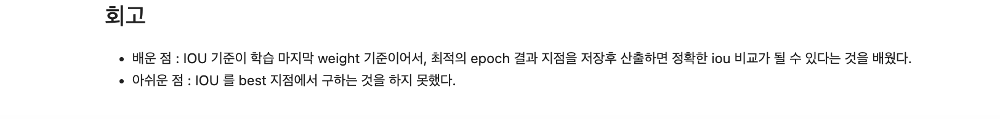
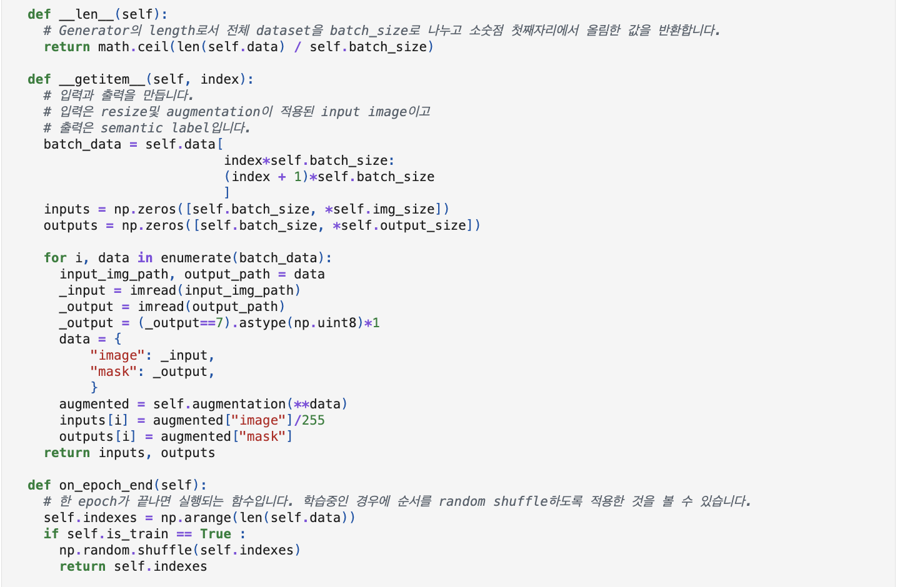

# AIFFEL Campus Online Code Peer Review Templete
- 코더 : 이주연.
- 리뷰어 : 신기성.


# PRT(Peer Review Template)
- [o]   **1. 주어진 문제를 해결하는 완성된 코드가 제출되었나요?**
    - 네 문제에서 요구하는 최종 결과물을  완성 되었습니다. 
        - 중요! 해당 조건을 만족하는 부분을 캡쳐해 근거로 첨부
	
	

- [o]  **2. 전체 코드에서 가장 핵심적이거나 가장 복잡하고 이해하기 어려운 부분에 작성된 
주석 또는 doc string을 보고 해당 코드가 잘 이해되었나요?**
    - 해당 코드 블럭이 핵심적인 이유는 구조가 인코더 디코더 구조로  짜져 있지만, 다운 샘플링 후, 
어디서 skip connection을 하기 위해서 concatenate을 하고 tranpose를 취해하는지가 중요한것 같고 
U-Net 구조는 많이 segmentation에서 reconstruction을 위해 많이   사용되기 때문에 중요한것 같습니다.
    - 해당 코드 블럭에 encoder 와 decoder 가 어느 파트에서 작동 되는지에 대한 기술은 되어 있습니다. 
    - 각 해당 코드에 대해서 기술 및 원리등이 작성 되어 있지는 않습니다. 
    - 이 내용을 모르는 사람이라면 코드를 보고 이해하기는 힘들지만, 어느정도 지식이 있는 분들이라면 이해 하실 수는 있을것 같습니다. 
        
	
        
- [o]  **3. 에러가 난 부분을 디버깅하여 문제를 해결한 기록을 남겼거나
새로운 시도 또는 추가 실험을 수행해봤나요?**
    - 네 문제원인과 해결을 시도한 기록을 남긴것을 확인 하였고,
    - 프로젝트 평가 기준에 더해 추가적으로 수행한 시도의 흔적이 보였습니다.
       
       
       


- [o]  **4. 회고를 잘 작성했나요?**
    - 네,  주어진 문제를 해결하는 완성된 코드 내지 프로젝트 결과물에 대해
    배운점과 아쉬운점, 느낀점 등이 기록을 확인 하였습니다.
    - 전체 코드 실행 플로우를 따로 그려서 보여주지는 않았지만, 맥락은 잡을 수 있었던것 같습니다.
        
	
	
	
	
	
        
- [ ]  **5. 코드가 간결하고 효율적인가요?**
    - 네, 파이썬 스타일 가이드 (PEP8) 를 준수하였는지 확인
    -네,  코드 중복을 최소화하고 범용적으로 사용할 수 있도록 함수화/모듈화했는지 확인
        


# 회고(참고 링크 및 코드 개선)
```
# 리뷰어의 회고를 작성합니다.
# 저는 이코드를 리뷰하면서, "https://www.tldraw.com/f/had1bEKGDpMY8Q8kMZNB1?d=v0.0.1204.725.gy3YMzWHPArszLriTl700" 우리가 오전에 들은 렉쳐를 많이 참조하고 아이펠에 있는 노드 부분의 노트 자료등도 많이 참고
하였습니다. (https://arxiv.org/abs/1807.10165, https://arxiv.org/abs/1912.05074) 
# 우리가 앞에 배운 노드의 코드를 기반으로이번 프로젝트에서많이 적용하였는데 조금 더 아이디어를 내서
코드를  조금 바꿔본다거나 어떤 다른 방법의 시도들이 있을지에대한 고민도 해보는게 좋을거 같습니다. 
```
